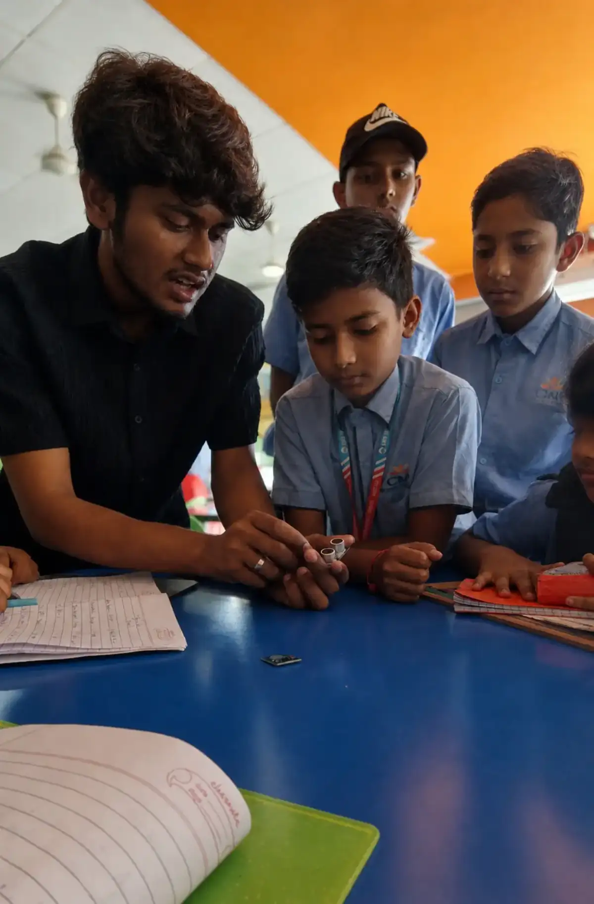
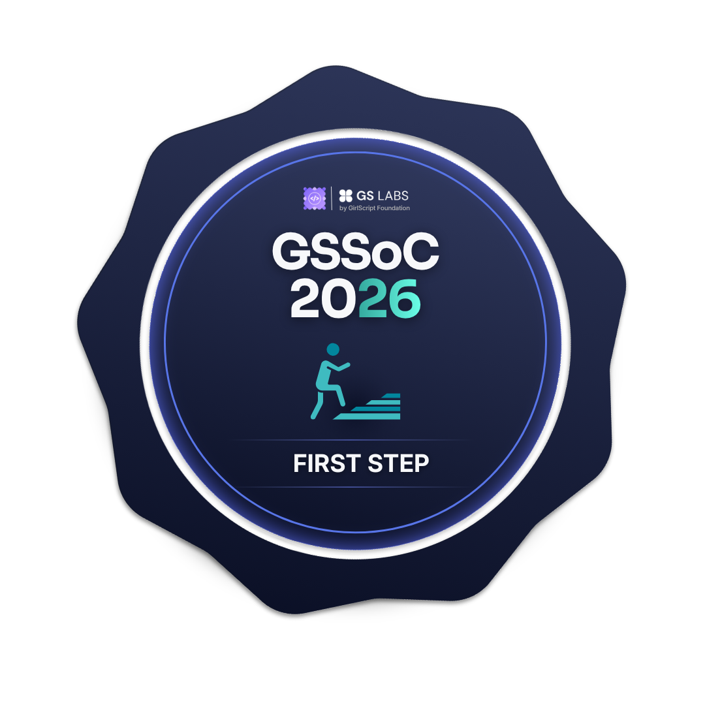

  <picture>
    <source media="(prefers-color-scheme: dark)" srcset="header-dark.svg?v=1781461115">
    <source media="(prefers-color-scheme: light)" srcset="header-light.svg?v=1781461115">
    
  </picture>

<em>Just a Tech.</em>

  
  
  
  
  
   
  
  
  
  

 

  

<h2 align="center">About Me</h2>

<table width="100%">
  <tr>
    <td width="65%" valign="top">
      <h3>Hi there! I'm Shankumar</h3>
      
I’m a B.Tech Computer Science (Data Science) student at CMRCET, currently interning at the <b>Military College of Electronics and Mechanical Engineering (MCEME)</b>. I develop advanced training simulators for the Indian Army using AI, AR/VR.

      
My expertise spans <b>full‑stack development</b>, <b>data science</b>, and <b>cybersecurity</b>. I build solutions that are <b>scalable</b>, <b>efficient</b>, and <b>secure by design</b>.

      <h4>What I Do</h4>
      <ul>
        <li><b>Full‑Stack Development</b> – Craft clean, maintainable web applications.</li>
        <li><b>Data Science & AI</b> – Transform raw data into actionable insights.</li>
        <li><b>Cybersecurity</b> – Embed security from the ground up.</li>
      </ul>
    </td>
    <td width="35%" align="center" valign="middle">
      
        
      
    </td>
  </tr>
</table>

<h3 align="center">Highlights</h3>
<table align="center" width="100%">
  <tr>
    <td width="50%" align="center">
      Intern at <kbd>MCEME</kbd> (Defence Electronics)
    </td>
    <td width="50%" align="center">
      <kbd>4×</kbd> Hackathon Winner
    </td>
  </tr>
  <tr>
    <td width="50%" align="center">
      GPA <kbd>9.11/10</kbd> at CMRCET
    </td>
    <td width="50%" align="center">
      Mentored <kbd>60+</kbd> students (ATL)
    </td>
  </tr>
  <tr>
    <td colspan="2" align="center">
      <b>Google Student Ambassador ’26</b> & <b>GSSoC ’26 Contributor</b>
    </td>
  </tr>
</table>

<h3 align="center">What I'm Up To</h3>
<table align="center" width="100%">
  <tr>
    <td width="30%" align="right"><b>Currently focusing on:</b></td>
    <td width="70%">Advanced IoT Security frameworks & Computer Vision pipelines</td>
  </tr>
  <tr>
    <td width="30%" align="right"><b>Looking to collaborate on:</b></td>
    <td width="70%">Full-stack architecture & open-source initiatives</td>
  </tr>
</table>

 

  <i>"I thrive on solving hard problems with real‑world impact. Whether it’s a midnight hackathon or a defence‑grade simulator, I show up and ship."</i>

  

<h2 align="center">Tech Stack</h2>

<table width="100%">
  <tr>
    <td width="50%" valign="top" align="center">
      <b>Languages</b>  
      
      
      
      
       
      
      
      
    </td>
    <td width="50%" valign="top" align="center">
      <b>Frontend & Frameworks</b>  
      
      
      
      
       
      
      
      
    </td>
  </tr>
  <tr>
    <td width="50%" valign="top" align="center">
      <b>Backend, Databases & Cloud</b>  
      
      
      
       
      
      
      
    </td>
    <td width="50%" valign="top" align="center">
      <b>DevOps & Data Tools</b>  
      
      
      
       
      
      
      
       
      
      
    </td>
  </tr>
  <tr>
    <td colspan="2" valign="top" align="center">
      <b>Hardware, IoT & Security</b>  
      
      
      
      
       
      
      
      
      
    </td>
  </tr>
</table>

  

<h2 align="center">Featured Projects</h2>

<table width="100%">
  <tr>
    <td width="50%" valign="top" align="center">
      <h3>AuthSphere</h3>
      <b>Self‑Hosted IoT Security Framework</b> 
      <blockquote><i>A patented, certificate‑driven solution that secures resource‑constrained IoT devices with automated onboarding and zero vendor lock‑in.</i></blockquote> 
      
      
      
      
      
      
    </td>
    <td width="50%" valign="top" align="center">
      <h3>ClassCom</h3>
      <b>Academic Resource Gateway</b> 
      <blockquote><i>Full‑stack platform serving 210+ students with study materials, assignment tracking, and a Xerox print‑order pipeline generating ₹2.6L+ revenue.</i></blockquote> 
      
      
      
      
    </td>
  </tr>
  <tr>
    <td width="50%" valign="top" align="center">
      <h3>DARKS Rakshak</h3>
      <b>Disaster Response Drone System</b> 
      <blockquote><i>Dual‑drone architecture where a carrier deploys an autonomous reconnaissance unit, improving survivor detection in flood rescues.</i></blockquote> 
      
      
      
      
    </td>
    <td width="50%" valign="top" align="center">
      <h3>Snippet Scanner</h3>
      <b>Static Code Security Analyzer</b> 
      <blockquote><i>Rapid tool that flags OWASP Top 10 vulnerabilities in code snippets and offers remediation guidance.</i></blockquote> 
      
      
      
      
    </td>
  </tr>
  <tr>
    <td width="50%" valign="top" align="center">
      <h3>Arogya Drishti</h3>
      <b>Secure Hospital Management System</b> 
      <blockquote><i>End‑to‑end platform built with IoT security and data integrity at its core.</i></blockquote> 
      
      
      
    </td>
    <td width="50%" valign="top" align="center">
      <h3>Tomato Sorter &amp; TECHBOW</h3>
      <b>Computer Vision &amp; Human‑Robot Interaction</b> 
      <blockquote><i>Vision pipeline for automated produce sorting, paired with HRI research for intuitive interaction.</i></blockquote> 
      
      
      
      
    </td>
  </tr>
</table>

  

<h2 align="center">GSSoC ’26 – Open Source Contribution</h2>

  

| Metric | Value |
|:--|:--|
| Global Rank | **#936** out of 43,586 participants |
| Leaderboard Score | **2,877 pts** · **Top 3%** |
| Current Tier | **C Tier** |

 

  
  
  
  
  
  
  
  
  
  
  

  

<h2 align="center">Certifications & Achievements</h2>

  <table>
    <tr>
      <th>#</th>
      <th>Achievement</th>
    </tr>
    <tr>
      <td align="center">1</td>
      <td><b>4× Hackathon Winner</b> – National‑level competitions</td>
    </tr>
    <tr>
      <td align="center">2</td>
      <td><b>Google Student Ambassador ’26</b> – Google Developer Ecosystem</td>
    </tr>
    <tr>
      <td align="center">3</td>
      <td><b>Tata Consultancy Services</b> – GenAI Powered Data Analytics</td>
    </tr>
    <tr>
      <td align="center">4</td>
      <td><b>Deloitte Australia</b> – Data Analytics Job Simulation</td>
    </tr>
    <tr>
      <td align="center">5</td>
      <td><b>ATL Mentor</b> – Guided 60+ students at Atal Tinkering Labs</td>
    </tr>
  </table>

  

<h2 align="center"> GitHub Stats</h2>

  
  

 

  <picture>
    <source media="(prefers-color-scheme: dark)" srcset="https://raw.githubusercontent.com/shankumar7/shankumar7/output/github-contribution-grid-snake-dark.svg">
    <source media="(prefers-color-scheme: light)" srcset="https://raw.githubusercontent.com/shankumar7/shankumar7/output/github-contribution-grid-snake.svg">
    
  </picture>

  

  

 

  <h3>Let's Connect!</h3>
  
Always open to discussing new opportunities, open-source collaborations, or tech in general. Reach out to me at <a href="mailto:shankumarpitta714@gmail.com">shankumarpitta714@gmail.com</a>.

 

  <picture>
    <source media="(prefers-color-scheme: dark)" srcset="footer-dark.svg?v=1781461115">
    <source media="(prefers-color-scheme: light)" srcset="footer-light.svg?v=1781461115">
    
  </picture>

